# 技术方案架构设计文档

> 项目名称：雨虹渠道智慧运营助手（Yuhong Channel Smart Operations Assistant）
> 项目：东方雨虹渠道智慧运营解决方案
> 方向：AI + 营销推广（华北区域）
> 文档版本：V1.1
> 最后更新：2026-07-11

---

## 文档说明

本文档为"雨虹渠道智慧运营助手"项目的技术架构设计方案，系统阐述系统总体架构、五大核心模块技术设计、数据架构、飞书API对接方案、安全权限设计、部署架构及技术选型。方案深度依托飞书AI生态（aily智能体、多维表格AI、妙搭低代码平台），面向东方雨虹全国3000余家品牌专卖店、10000余家终端网点（累计覆盖29万分销网点）的渠道智慧运营需求，提供可落地、可扩展的一体化解决方案。方案围绕三大目标构建：目标1-渠道标准化管理体系（门店巡检+渠道管理中枢-标准化看板）、目标2-AI导购赋能平台（AI导购模块含话术训练/智能测评/效果图生成）、目标3-智能经营分析与预警中枢（门店运营+客户维护+渠道管理中枢-分单/履约/洞察）。

---

## 一、系统总体架构

### 1.1 架构设计理念

本系统采用"飞书AI原生 + 分层解耦"的架构设计理念，以飞书生态为底座，将东方雨虹渠道运营的五大核心场景（巡检、导购、运营、私域、渠道管理）抽象为独立而协同的功能模块。架构设计遵循以下原则：

- **AI原生**：所有业务模块均以飞书AI能力为核心驱动，而非简单的外挂式集成；
- **低代码优先**：优先采用飞书妙搭低代码平台与多维表格，降低开发与部署成本，适配累计覆盖29万分销网点的规模化推广；
- **数据闭环**：通过多维表格统一数据底座，实现"采集 → 分析 → 决策 → 执行"的数据闭环；
- **分层解耦**：渠道层、用户层、应用层、AI能力层、数据层、生态层各司其职，模块可独立部署、渐进推广。

### 1.2 系统总体架构图

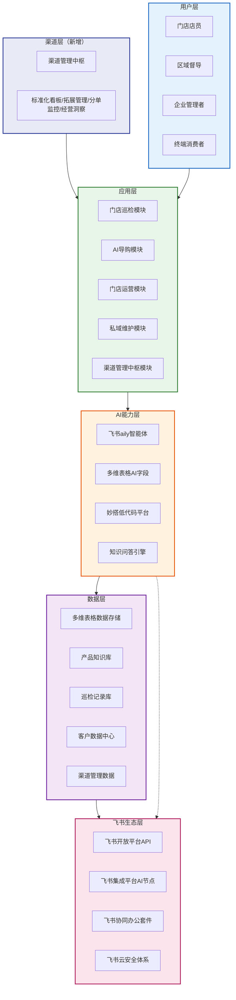

### 1.3 架构分层说明

| 层级 | 定位 | 核心组件 | 职责说明 |
|------|------|---------|---------|
| 渠道层 | 渠道管理中枢 | 标准化看板、拓展管理、分单监控、经营洞察 | 站在总部/区域经理视角，汇总全渠道巡检数据、管理网点拓展、智能分单与履约监控、跨门店经营洞察 |
| 用户层 | 交互入口 | 门店店员、区域督导、企业管理者、消费者 | 不同角色通过飞书客户端/移动端访问对应功能，各角色权限与视图差异化 |
| 应用层 | 业务承载 | 门店巡检、AI导购、门店运营、私域维护、渠道管理中枢 | 承载五大业务场景，提供表单、对话、看板、任务等应用形态 |
| AI能力层 | 智能驱动 | aily智能体、多维表格AI、妙搭低代码、知识问答 | 提供语义理解、图像识别、数据分析、内容生成等AI能力 |
| 数据层 | 数据底座 | 多维表格存储、产品知识库、巡检记录、客户数据、渠道管理数据 | 统一数据存储与治理，支撑AI分析与业务决策 |
| 飞书生态层 | 平台基座 | 开放平台API、集成平台AI节点、协同办公、云安全 | 提供API网关、AI推理节点、协同能力与企业级安全保障 |

### 1.4 架构数据流转总览

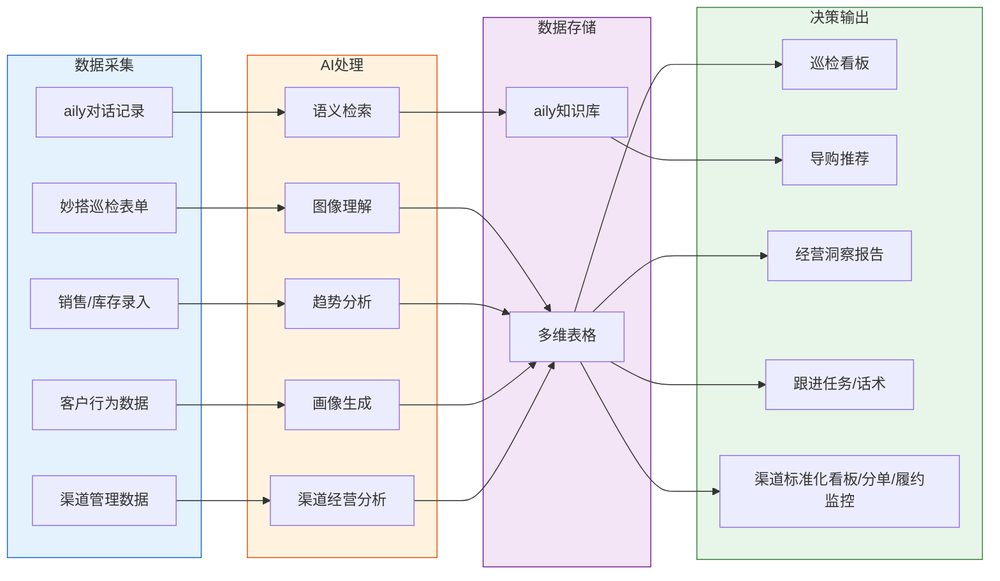

---

## 二、五大核心模块技术设计

### 2.1 门店巡检模块

#### 2.1.1 技术方案

门店巡检模块采用"飞书妙搭低代码应用 + 飞书集成平台AI图像理解节点 + 多维表格数据存储"的技术组合，实现巡检全流程数字化与陈列合规性智能检测。

- **前端巡检应用**：基于飞书妙搭（aPaaS低代码平台）搭建移动端巡检应用，店员通过飞书移动端即可完成巡检表单填写、陈列照片上传，无需安装独立App；
- **AI图像识别**：巡检照片上传后，通过飞书集成平台AI节点（图像理解模型）自动分析陈列合规性，识别产品分区、货架利用率、价签覆盖率、卫生状况等维度；
- **数据存储与看板**：巡检结果自动写入多维表格，并通过多维表格仪表盘自动生成门店巡检数据看板，支持督导实时查看。

#### 2.1.2 巡检检查项标准

巡检表单覆盖六大维度，总分100分，80分以上为合格：

| 检查项 | 满分 | 核心检查点 |
|--------|------|-----------|
| 产品陈列标准 | 20 | 品类分区陈列、畅销品黄金位、陈列面整洁、价签对应 |
| 门店卫生状况 | 15 | 地面清洁、展架无尘、样品完好、照明正常 |
| 价签与促销物料 | 15 | 价签完整、海报规范、活动信息更新、无缺失 |
| 库存与样品展示 | 20 | 样品充足、滞销品下架、新品上架、账实一致 |
| 服务规范 | 15 | 统一工装、话术规范、响应及时、流程清晰 |
| 安全合规 | 15 | 消防通道、危险品存放、电气安全、应急标识 |

#### 2.1.3 数据流设计

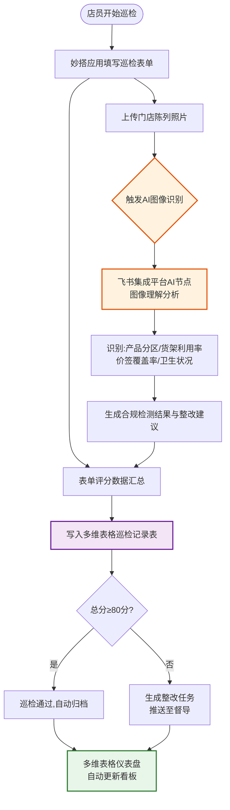

#### 2.1.4 API对接方案

| 对接对象 | API/能力 | 用途 | 调用方式 |
|---------|---------|------|---------|
| 多维表格 | 记录创建API | 巡检结果写入巡检记录表 | `POST /bitable/v1/apps/{app_token}/tables/{table_id}/records` |
| 飞书集成平台 | AI节点-图像理解 | 分析陈列照片合规性 | 集成平台工作流编排，图像输入→AI节点推理→结构化输出 |
| 多维表格 | 记录查询API | 获取巡检历史记录 | `GET /bitable/v1/apps/{app_token}/tables/{table_id}/records` |
| 飞书消息 | 消息发送API | 整改任务推送至督导 | `POST /im/v1/messages` |

#### 2.1.5 核心实现

巡检结果提交与AI检测的核心逻辑（基于项目 `store_inspection.py` 模块）：

```python
def submit_inspection(self, store_id, inspector, scores, photos=None, notes=""):
    """提交巡检结果,自动计算等级并写入多维表格"""
    total_score = sum(scores.values())
    passed = total_score >= 80
    level = "优秀" if total_score >= 90 else "合格" if total_score >= 80 else "不合格"

    record = {
        "门店编号": store_id, "巡检人": inspector,
        "巡检时间": datetime.now().strftime("%Y-%m-%d %H:%M"),
        "总分": total_score, "巡检结果": level,
        "是否通过": "通过" if passed else "不通过",
        "照片附件": photos or []
    }
    # 写入飞书多维表格
    if self.bitable and not self.config.USE_MOCK_DATA:
        self.bitable.create_record(self.config.BITABLE_INSPECTION_TABLE_ID, record)
    return record
```

---

### 2.2 AI导购模块

#### 2.2.1 技术方案

AI导购模块以飞书aily智能体为核心，构建东方雨虹产品知识Agent，为门店店员与终端消费者提供7×24小时专业产品咨询、智能推荐与施工方案指导。

- **aily智能体构建**：在飞书aily平台创建"雨虹AI导购"智能体，配置产品知识库、对话提示词（Prompt）、推荐策略；
- **知识库导入**：将东方雨虹8大产品线的产品手册、施工方案、常见问题FAQ结构化导入aily知识库，构建专属知识检索能力；
- **多轮对话能力**：支持语义理解、上下文记忆、多轮追问，精准识别用户场景需求（卫生间漏水、外墙渗水、屋面防水等）；
- **智能推荐**：基于场景、面积、预算等参数，推荐最优产品组合并自动计算用量与成本。

#### 2.2.2 知识库构建

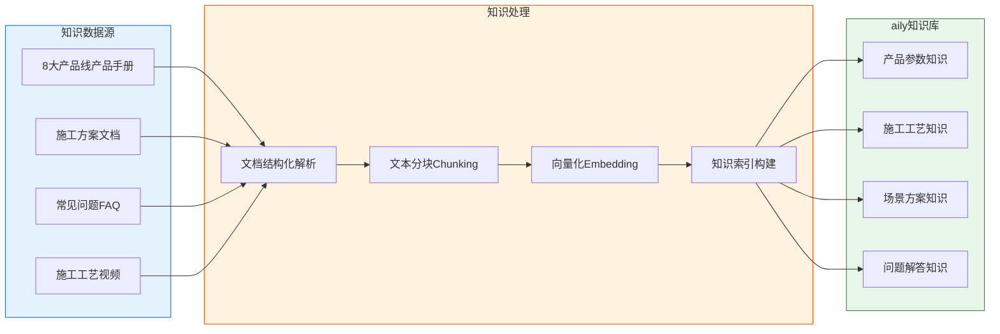

知识库覆盖东方雨虹8大产品线：

| 产品线 | 代表产品 | 知识内容 |
|--------|---------|---------|
| 防水涂料 | JS复合防水涂料、聚氨酯防水涂料、透明防水胶 | 产品参数、适用场景、施工工艺、用量计算 |
| 防水卷材 | SBS改性沥青防水卷材 | 规格、铺贴工艺、搭接规范 |
| 瓷砖胶 | 雨虹瓷砖胶 | 粘结等级、铺贴工艺、适用砖型 |
| 密封胶 | 硅酮密封胶 | 适用缝隙、耐候性能、施工要点 |
| 美缝剂 | 环氧彩砂美缝剂 | 颜色选择、施工流程、固化时间 |
| 修缮材料 | 聚合物修补砂浆 | 裂缝处理、结构加固方案 |
| 施工方案 | 卫生间/外墙/屋面/地下室防水方案 | 标准施工流程、材料组合、注意事项 |
| 常见问题 | 漏水诊断、选型建议、用量计算 | FAQ问答库、场景化推荐策略 |

#### 2.2.3 对话流程设计

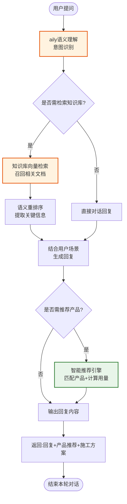

#### 2.2.4 API对接方案

| 对接对象 | API | 用途 | 文档地址 |
|---------|-----|------|---------|
| aily智能体 | 会话创建API | 创建导购对话会话 | https://open.larkoffice.com/document/aily-v1/aily_session/create |
| aily智能体 | 消息发送API | 发送用户问题至智能体 | https://open.larkoffice.com/document/aily-v1/aily_session-aily_message/create |
| aily智能体 | 消息列表API | 获取智能体回复内容 | `GET /aily/v1/sessions/{session_id}/messages` |
| 飞书鉴权 | 租户访问令牌 | 获取API调用凭证 | `POST /auth/v3/tenant_access_token/internal` |

#### 2.2.5 核心实现

aily对话调用封装（基于项目 `feishu_aily.py`）：

```python
def chat(self, message, session_id=None, user_id=None):
    """便捷对话:创建会话+发送消息+返回回复"""
    if not session_id:
        session_id = self.create_session(user_id)
    self.send_message(session_id, message)
    messages = self.list_messages(session_id)
    for msg in reversed(messages):
        if msg.get("sender_type") == "aily":
            return {"session_id": session_id, "reply": msg.get("content", "")}
    return {"session_id": session_id, "reply": ""}
```

#### 2.2.6 销售话术训练（新增功能）

AI导购赋能平台新增销售话术训练能力，利用aily智能体扮演客户角色，与导购进行对话练习，AI实时纠偏。

- **技术方案**：配置一个"客户扮演型"aily智能体，预设典型建材消费场景（卫生间漏水咨询、屋顶防水选材、瓷砖胶对比等），导购通过对话练习销售话术，aily实时评估并给出改进建议；
- **实现方式**：aily智能体一方面按预设人设提出消费者常见疑问，另一方面在导购回答后基于产品知识库判断准确性，给出纠偏提示；
- **参考数据**：AI陪练减少60%资料整理时间，培训时效提升49%，培训成本降低32%（来源：中关村科金得助智能、北森HRSaaS）。

#### 2.2.7 智能测评（新增功能）

AI导购赋能平台新增多维度智能测评能力，对导购的销售对话进行多维度评分并附带逐句改进建议。

- **测评维度**：流利度（表达连贯性）、专业度（产品知识准确性）、逻辑结构（推荐方案合理性）三大核心维度，附带逐句改进建议；
- **技术方案**：导购完成话术训练对话后，aily智能体基于对话记录生成结构化评分报告，包括各维度得分、具体扣分点、改进建议；
- **参考数据**：新导购首月成交率从40%提升至65%，成单转化率提升19%，员工流失率从28%降至19%（来源：中关村科金得助智能、上海思创）。

#### 2.2.8 产品效果图自动生成（新增功能）

AI导购赋能平台新增产品效果图自动生成能力，基于妙搭页面与AI图像生成技术，根据施工场景自动生成3D效果图。

- **技术方案**：在妙搭低代码平台搭建效果图生成页面，导购输入施工场景（卫生间/屋顶/地下室等）与面积参数，AI基于扩散模型+ControlNet+文生图技术自动生成PBR材质准确的照片级3D效果图；
- **应用场景**：消费者到店咨询时，导购可现场生成施工前后对比效果图，增强消费者直观感知与信任，提升成交转化率；
- **参考数据**：AI可在10秒内生成3D效果图，完整出图周期不超过10分钟，3秒内生成照片级效果图（来源：什么值得买评测、酷家乐、PingCode）。

---

### 2.3 门店运营模块

#### 2.3.1 技术方案

门店运营模块采用"多维表格AI字段 + AI工作流 + 仪表盘可视化"的技术方案，实现销售、库存、客流数据的自动分析与经营洞察智能生成。

- **多维表格AI字段**：在销售数据表、库存表、客流数据表中配置AI字段，自动分析销售趋势、识别异常、生成摘要；
- **AI工作流**：通过飞书集成平台编排AI工作流，定时聚合多维表格数据，生成经营洞察报告，推送至管理者；
- **可视化看板**：多维表格仪表盘提供原生数据图表，前端通过Chart.js渲染增强型经营看板。

#### 2.3.2 数据表设计

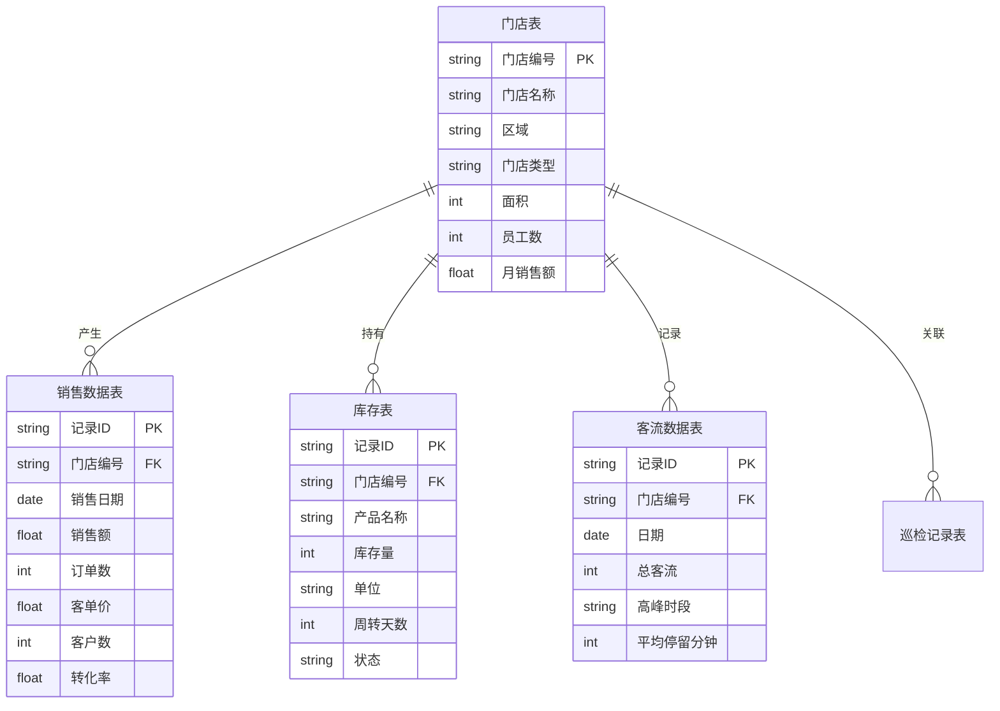

#### 2.3.3 AI能力设计

| AI能力类型 | 实现方式 | 应用场景 | 输出示例 |
|-----------|---------|---------|---------|
| AI字段-趋势分析 | 多维表格AI字段公式 | 销售额环比/同比分析 | "本月销售额环比增长12%，主要驱动为防水涂料品类" |
| AI字段-异常检测 | AI字段+阈值规则 | 库存周转异常预警 | "瓷砖胶周转45天，存在积压风险" |
| AI字段-摘要生成 | AI字段自动生成 | 日报/周报摘要 | "今日销售2.1万元，转化率35%，客流高峰14-16点" |
| AI工作流-洞察报告 | 集成平台AI节点编排 | 月度经营洞察报告 | 含销售概况、库存健康度、客流分析、优化建议的完整报告 |

#### 2.3.4 经营洞察报告生成流程

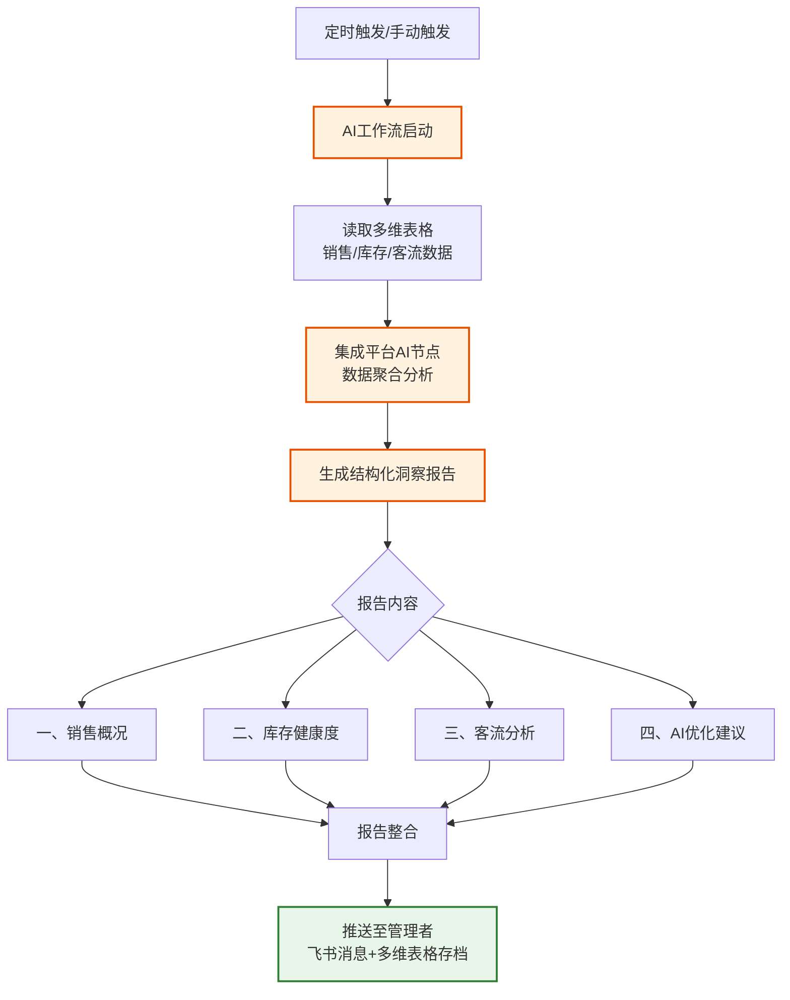

#### 2.3.5 可视化方案

- **多维表格仪表盘**：原生支持柱状图、折线图、饼图、漏斗图等，配置即用，适合督导快速查看；
- **Chart.js前端看板**：基于Bootstrap 5响应式布局，通过Chart.js渲染销售趋势折线图、库存预警柱状图、客流热力图、转化漏斗图，支持门店切换与时间筛选。

---

### 2.4 私域客户维护模块

#### 2.4.1 技术方案

私域客户维护模块采用"aily智能体 + 多维表格客户管理表"的技术方案，实现客户画像自动构建、个性化跟进话术生成、跟进任务自动化。

- **客户数据管理**：多维表格存储客户基础信息、购买记录、行为数据，AI字段自动生成客户标签与分层；
- **AI话术生成**：aily智能体基于客户画像（会员等级、偏好品类、流失风险等）生成个性化跟进话术；
- **自动化跟进**：aily工作流根据客户分层与流失风险，自动创建跟进任务并定时提醒店员执行。

#### 2.4.2 客户画像与分层

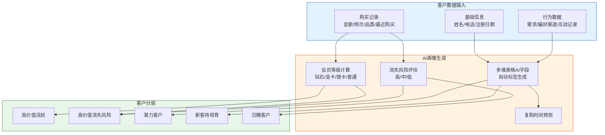

#### 2.4.3 客户分层策略

| 客户分层 | 判定条件 | 运营策略 | 跟进话术场景 |
|---------|---------|---------|-------------|
| 高价值活跃 | LTV>1万且流失风险低 | 保持服务品质，定期推送新品，提升复购频次 | 复购跟进 |
| 高价值流失风险 | LTV>1万且流失风险中/高 | 立即启动挽回计划，专属顾问1对1回访 | 流失挽回 |
| 潜力客户 | LTV>3千 | 设计升级路径，推荐高毛利配套产品 | 复购跟进 |
| 新客待培育 | 购买频次≤1 | 发送防水知识科普+首次复购优惠券 | 节日关怀 |
| 沉睡客户 | 长期无互动 | 批量短信触达，低成本唤醒 | 流失挽回 |

#### 2.4.4 自动化跟进流程

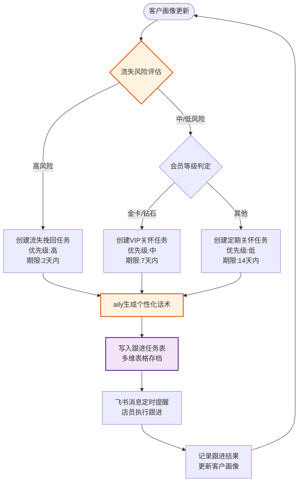

#### 2.4.5 API对接方案

| 对接对象 | API | 用途 |
|---------|-----|------|
| 多维表格 | 记录创建/更新API | 客户画像与跟进任务写入客户表、跟进任务表 |
| 多维表格 | AI字段 | 自动生成客户标签、流失风险评分 |
| aily智能体 | 消息发送API | 基于客户画像生成个性化跟进话术 |
| 飞书消息 | 消息发送API | 跟进任务定时提醒推送至店员 |

---

### 2.5 渠道管理中枢模块（新增）

#### 2.5.1 模块定位与技术方案

渠道管理中枢模块站在东方雨虹总部/区域经理视角，管理全渠道（3000余家品牌专卖店、10000余家终端网点，累计覆盖29万分销网点）的标准化、拓展、分单和经营洞察。该模块是连接门店层与总部管理层的"渠道大脑"，将单店运营数据上卷为全渠道管理视图。

- **技术方案**：采用"多维表格AI字段（渠道管理表组）+ aily智能体（渠道经营分析对话）+ Flask新增/channel路由"的技术组合，实现渠道数据汇总、分析与可视化；
- **数据底座**：飞书多维表格新增渠道管理表组（渠道网点表、订单分单表、履约监控表、渠道拓展档案表），与门店表、巡检记录表、销售数据表关联；
- **前端**：Flask新增 `/channel` 路由 + `channel.html` 页面，提供渠道标准化看板、拓展管理、分单监控、经营洞察四大视图。

#### 2.5.2 四大功能设计

**功能1：渠道标准化看板**

| 能力 | 实现方式 | 输出示例 |
|------|---------|---------|
| 全渠道巡检汇总 | 多维表格聚合巡检记录表数据，按区域/门店类型/经销商维度汇总 | "华北区域合规率92%，华东区域88%" |
| 合规率热力图 | 全国地图展示各区域合规率，颜色深浅反映合规水平 | 热力图：绿色（合规率>90%）、黄色（80-90%）、红色（<80%） |
| 整改完成率追踪 | 关联巡检整改任务，统计整改闭环率 | "本月发现问题127项，已整改108项，闭环率85%" |

**功能2：渠道拓展管理**

| 能力 | 实现方式 | 参考数据 |
|------|---------|---------|
| 新网点开发档案 | 多维表格记录选址评分、租金评估、市场分析 | 建材市场租金60-120元/㎡（一线），三线城市40+元/㎡ |
| 开业进度跟踪 | 装修→铺货→培训→开业→首月扶持全流程跟踪 | 轻资产模式15天开业，100平米开店10余万元投资 |
| 新店首月业绩追踪 | 关联销售数据表，自动计算新店首月营收 | 经销商年度平均营收不低于120万元 |

**功能3：智能分单与履约监控（新增功能）**

| 能力 | 实现方式 | 参考数据 |
|------|---------|---------|
| 智能分单 | 多维表格自动化，根据网点位置/库存/配送能力自动分配订单 | 传统紧急订单履约率不足60%，建材传统模式交付周期7-10天 |
| 履约进度实时监控 | 已下单→已发货→已到货→已施工全链路跟踪 | — |
| 超时预警 | 多维表格AI字段自动计算履约时长，超时自动推送预警 | — |
| 断货风险预警 | 关联库存表，库存低于安全线自动预警 | 经销商备货失误率高达35%，库存周转率仅3.8次/年 |

**功能4：渠道经营洞察**

| 能力 | 实现方式 | 输出示例 |
|------|---------|---------|
| 跨门店销售对比 | 多维表格聚合销售数据，按门店/区域对比 | "TOP10门店销售额排名，区域销售贡献占比" |
| 区域排名 | 省/市/县维度排名，识别强势区域与薄弱区域 | "广东省销售额排名全国第3，同比增长15%" |
| 产品动销分析 | 分析哪些产品在哪些区域卖得好 | "SBS卷材在华东区域动销最快，周转天数18天" |
| AI经营洞察报告 | aily智能体跨门店汇总分析，对话式生成洞察 | "本月全渠道合规率89%，建议加强西南区域巡检频次..." |

#### 2.5.3 数据流设计

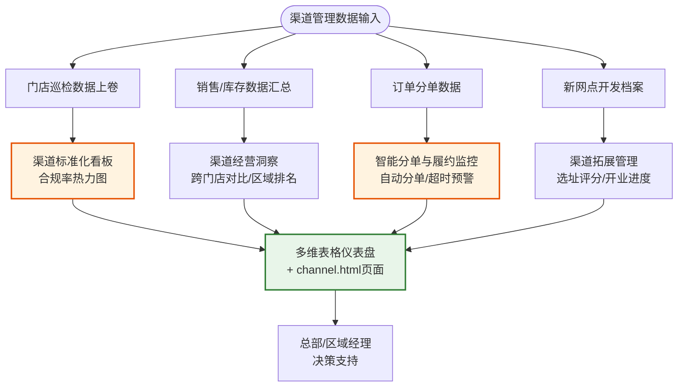

#### 2.5.4 API对接方案（新增6个渠道管理API）

| API名称 | 调用方式 | 用途 |
|---------|---------|------|
| 渠道标准化看板查询 | `GET /api/channel/compliance_dashboard` | 获取全渠道巡检合规率汇总、区域排名 |
| 合规率热力图数据 | `GET /api/channel/compliance_heatmap` | 获取全国各区域合规率热力图数据 |
| 渠道拓展档案管理 | `POST /api/channel/expansion_archive` | 新增/更新新网点开发档案 |
| 开业进度跟踪 | `GET /api/channel/expansion_progress` | 查询新网点开业进度与首月业绩 |
| 智能分单 | `POST /api/channel/auto_dispatch` | 根据网点位置/库存/配送能力自动分配订单 |
| 履约风险监控 | `GET /api/channel/fulfillment_monitor` | 监控订单履约进度，超时/断货预警 |

#### 2.5.5 核心实现

渠道管理中枢的核心逻辑（基于项目 `channel_management.py` 模块）：

```python
def get_compliance_dashboard(self, region=None):
    """获取渠道标准化看板数据：汇总全渠道巡检合规率"""
    records = self.bitable.query_records(self.config.BITABLE_INSPECTION_TABLE_ID)
    # 按区域/门店类型汇总合规率
    dashboard = {}
    for record in records:
        area = record.get("区域", "未知")
        passed = record.get("是否通过") == "通过"
        dashboard.setdefault(area, {"total": 0, "passed": 0})
        dashboard[area]["total"] += 1
        if passed:
            dashboard[area]["passed"] += 1
    # 计算合规率
    for area, data in dashboard.items():
        data["compliance_rate"] = round(data["passed"] / data["total"] * 100, 1)
    return dashboard

def auto_dispatch(self, order):
    """智能分单：根据网点位置/库存/配送能力自动分配订单"""
    # 查询附近网点库存与配送能力
    candidates = self.bitable.query_records(
        self.config.BITABLE_STORE_TABLE_ID,
        filter=f"AND(CurrentValue.[区域]='{order['region']}',CurrentValue.[运营状态]='运营中')"
    )
    # 按库存充足度+配送能力排序，选择最优网点
    best_store = max(candidates, key=lambda s: s.get("库存评分", 0))
    return {"dispatched_store": best_store["门店编号"], "status": "已分单"}
```

---

## 三、数据架构设计

### 3.1 数据架构总览

系统以飞书多维表格为统一数据底座，所有业务数据集中存储于一个多维表格应用（Bitable App）下，通过多张数据表关联组织，形成完整的数据模型。数据架构兼顾开发Demo阶段的本地JSON模拟数据与生产环境的飞书多维表格真实存储。

### 3.2 多维表格数据表设计

| 表名 | 核心字段 | 用途 |
|------|---------|------|
| 门店表 | 门店编号、门店名称、区域、门店类型、面积(㎡)、员工数、月销售额、开业日期、运营状态 | 存储全国门店基础信息，作为所有业务数据的关联主表 |
| 巡检记录表 | 门店编号、巡检人、巡检时间、陈列标准得分、卫生状况得分、价签物料得分、库存样品得分、服务规范得分、安全合规得分、总分、巡检结果、是否通过、照片附件、备注 | 记录每次巡检明细，支撑巡检看板与趋势分析 |
| 产品知识表 | 产品编号、产品名称、产品线、产品描述、价格、单位、每平米用量、评分、关键词、适用场景、施工步骤、注意事项、施工视频、预估工时、难度等级 | 存储东方雨虹8大产品线产品知识，支撑AI导购知识库 |
| 客户表 | 客户编号、姓名、电话、注册日期、累计消费金额、购买次数、最近购买日期、偏好品类、偏好渠道、会员等级、客户标签、流失风险、下次购买预测 | 存储私域客户数据，AI字段自动生成标签与分层 |
| 销售数据表 | 记录ID、门店编号、销售日期、销售额、订单数、客单价、客户数、转化率 | 记录门店每日销售明细，支撑运营看板与趋势分析 |
| 跟进任务表 | 任务ID、客户编号、任务类型、优先级、截止日期、跟进动作、话术场景、执行状态、执行人、完成时间 | 存储自动化生成的客户跟进任务，追踪执行情况 |
| 渠道网点表（新增） | 网点编号、网点名称、区域、网点类型（专卖店/终端网点）、地址、配送能力、库存评分、开业日期、运营状态 | 存储全渠道网点基础信息，支撑渠道管理中枢 |
| 订单分单表（新增） | 订单编号、网点编号、下单时间、分单时间、订单状态、分单网点、履约状态、预计到货时间、超时标记 | 记录智能分单与履约监控数据 |
| 渠道拓展档案表（新增） | 档案编号、网点名称、选址评分、租金评估、市场分析、开业进度、首月营收 | 管理新网点开发全流程档案 |

### 3.3 数据表关联关系

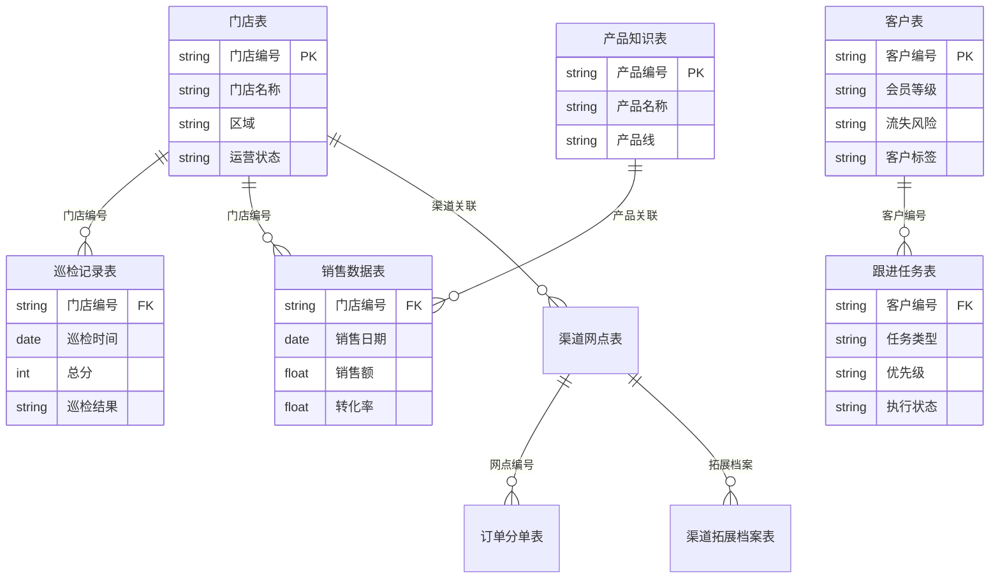

### 3.4 数据流转与治理

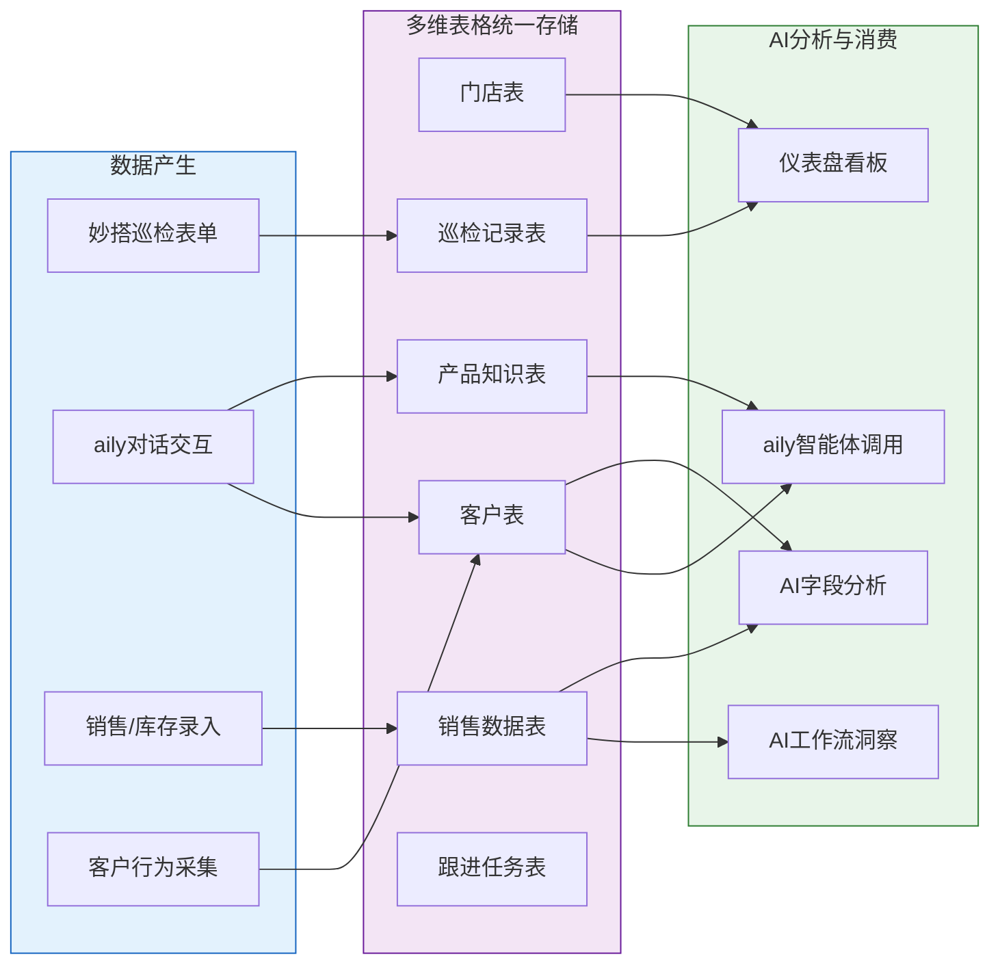

### 3.5 Demo模式数据策略

项目采用"模拟数据 + 真实API"双模式设计，未配置飞书API凭证时自动启用模拟数据模式：

| 模式 | 触发条件 | 数据来源 | 用途 |
|------|---------|---------|------|
| 模拟数据模式 | 未配置 `FEISHU_APP_ID` / `FEISHU_APP_SECRET` | 本地JSON文件（`data/`目录）+ 内存模拟逻辑 | 开发调试、Demo演示、方案展示 |
| 飞书API模式 | 已配置完整飞书凭证 | 飞书多维表格 + aily智能体 | 生产环境真实运行 |

模拟数据文件包括：
- `data/products.json`：8款东方雨虹产品完整知识数据
- `data/stores.json`：5家覆盖华北/华东/华南/华西的模拟门店
- `data/inspection_records.json`：历史巡检记录

---

## 四、API对接方案

### 4.1 飞书API对接总览

系统对接飞书开放平台三大类API能力，覆盖数据存储、AI对话、AI推理全链路：

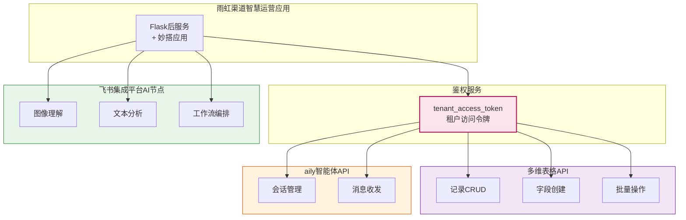

### 4.2 多维表格API

| API名称 | 调用方式 | 文档URL | 用途 |
|---------|---------|---------|------|
| 获取租户访问令牌 | `POST /auth/v3/tenant_access_token/internal` | https://open.feishu.cn/document/server-docs/authentication-management/access-token/tenant_access_token_internal | 获取所有API调用的访问凭证 |
| 查询记录 | `GET /bitable/v1/apps/{app_token}/tables/{table_id}/records` | https://open.feishu.cn/document/server-docs/docs/bitable-v1/app-table-record/list | 查询门店、巡检、客户等数据，支持分页与筛选 |
| 新增记录 | `POST /bitable/v1/apps/{app_token}/tables/{table_id}/records` | https://open.feishu.cn/document/server-docs/docs/bitable-v1/app-table-record/create | 写入巡检结果、客户画像、跟进任务等 |
| 更新记录 | `PUT /bitable/v1/apps/{app_token}/tables/{table_id}/records/{record_id}` | https://open.feishu.cn/document/server-docs/docs/bitable-v1/app-table-record/update | 更新跟进任务状态、客户信息等 |
| 删除记录 | `DELETE /bitable/v1/apps/{app_token}/tables/{table_id}/records/{record_id}` | https://open.feishu.cn/document/server-docs/docs/bitable-v1/app-table-record/delete | 清理无效数据 |
| 批量创建记录 | `POST /bitable/v1/apps/{app_token}/tables/{table_id}/records/batch_create` | https://open.feishu.cn/document/server-docs/docs/bitable-v1/app-table-record/batch_create | 批量导入产品知识、销售数据等 |
| 创建字段 | `POST /bitable/v1/apps/{app_token}/tables/{table_id}/fields` | https://open.feishu.cn/document/server-docs/docs/bitable-v1/app-table-field/create | 动态创建AI字段、数据列 |

**调用示例（记录创建）：**
```python
# 新增巡检记录
url = f"{base_url}/bitable/v1/apps/{app_token}/tables/{table_id}/records"
payload = {"fields": {"门店编号": "BJ-001", "总分": 92, "巡检结果": "优秀"}}
headers = {"Authorization": f"Bearer {access_token}", "Content-Type": "application/json"}
resp = requests.post(url, headers=headers, json=payload)
```

### 4.3 aily智能体API

| API名称 | 调用方式 | 文档URL | 用途 |
|---------|---------|---------|------|
| 创建会话 | `POST /aily/v1/sessions` | https://open.larkoffice.com/document/aily-v1/aily_session/create | 创建AI导购/客户跟进对话会话 |
| 发送消息 | `POST /aily/v1/sessions/{session_id}/messages` | https://open.larkoffice.com/document/aily-v1/aily_session-aily_message/create | 发送用户问题至aily智能体 |
| 获取消息列表 | `GET /aily/v1/sessions/{session_id}/messages` | https://open.larkoffice.com/document/aily-v1/aily_session-aily_message/list | 获取智能体回复内容 |

**调用示例（创建会话）：**
```python
# 创建aily会话
url = f"{base_url}/aily/v1/sessions"
payload = {"aily_app_id": aily_app_id}
headers = {"Authorization": f"Bearer {access_token}", "Content-Type": "application/json"}
resp = requests.post(url, headers=headers, json=payload)
session_id = resp.json()["data"]["aily_session_id"]
```

### 4.4 飞书集成平台AI节点

| AI能力 | 调用方式 | 用途 |
|--------|---------|------|
| 图像理解 | 飞书集成平台工作流编排，AI节点配置图像理解模型 | 门店巡检陈列照片合规性检测 |
| 文本分析 | 飞书集成平台AI节点，文本输入→结构化输出 | 销售数据摘要生成、客户评论情感分析 |
| AI工作流 | 飞书集成平台可视化编排，串联多维表格读取→AI推理→消息推送 | 经营洞察报告自动生成、跟进任务自动化 |

集成平台AI节点采用可视化拖拽编排，无需编写代码，通过配置输入输出参数与AI模型即可实现复杂业务流程自动化。

### 4.5 API调用鉴权流程

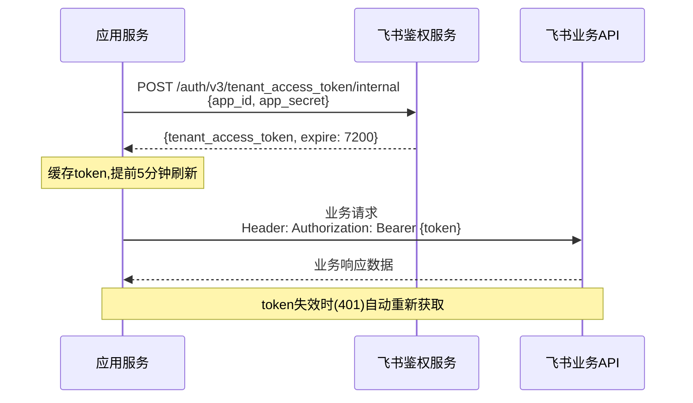

---

## 五、安全与权限设计

### 5.1 飞书企业版数据安全

系统基于飞书企业版安全体系，继承飞书平台的企业级安全保障能力：

- **传输加密**：所有API通信采用HTTPS/TLS加密传输，杜绝中间人攻击；
- **存储安全**：多维表格数据存储于飞书云端，享受飞书企业版数据加密存储与容灾备份；
- **访问控制**：基于飞书OAuth 2.0与租户访问令牌（tenant_access_token）实现应用级鉴权；
- **审计日志**：飞书管理后台提供完整的API调用日志与数据操作审计轨迹；
- **数据主权**：所有业务数据存储于企业自有飞书租户，数据所有权归属东方雨虹企业。

### 5.2 角色权限设计

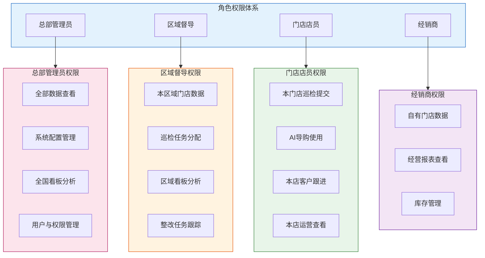

### 5.3 权限矩阵

| 功能模块 | 总部管理员 | 区域督导 | 门店店员 | 经销商 |
|---------|:---------:|:-------:|:-------:|:-----:|
| 门店巡检-提交 | 全部门店 | 本区域门店 | 仅本店 | 仅自有门店 |
| 门店巡检-查看 | 全部门店 | 本区域门店 | 仅本店 | 仅自有门店 |
| 巡检看板分析 | 全国看板 | 区域看板 | 本店看板 | 自有门店看板 |
| AI导购咨询 | 可用 | 可用 | 可用 | 可用 |
| 门店运营数据 | 全部门店 | 本区域门店 | 仅本店 | 仅自有门店 |
| 经营洞察报告 | 全国报告 | 区域报告 | 本店报告 | 自有门店报告 |
| 客户数据管理 | 全部客户 | 本区域客户 | 本店客户 | 自有客户 |
| 跟进任务管理 | 查看全部 | 分配与跟踪 | 执行本店任务 | 执行自有任务 |
| 渠道标准化看板（新增） | 全国看板 | 区域看板 | 无 | 自有门店看板 |
| 渠道拓展管理（新增） | 完全权限 | 本区域 | 无 | 仅自有档案 |
| 智能分单与履约（新增） | 全国监控 | 区域监控 | 查看本店 | 自有门店 |
| 渠道经营洞察（新增） | 全国洞察 | 区域洞察 | 本店数据 | 自有门店 |
| 系统配置 | 完全权限 | 无 | 无 | 无 |

### 5.4 数据隔离方案

- **行级数据隔离**：多维表格通过筛选条件（Filter）实现行级数据隔离，督导仅能查询本区域门店数据（`CurrentValue.[区域] = "华北"`），店员仅能查询本店数据（`CurrentValue.[门店编号] = "BJ-001"`）；
- **应用级隔离**：不同经销商的门店数据可通过独立多维表格应用实现物理隔离，确保数据互不可见；
- **字段级权限**：敏感字段（如客户手机号、销售额）可通过多维表格字段权限配置，限制特定角色的查看与编辑权限；
- **API级鉴权**：所有API调用携带tenant_access_token，飞书平台校验应用权限范围（Scopes），确保应用仅能访问授权范围内的资源。

---

## 六、部署架构

### 6.1 部署架构总览

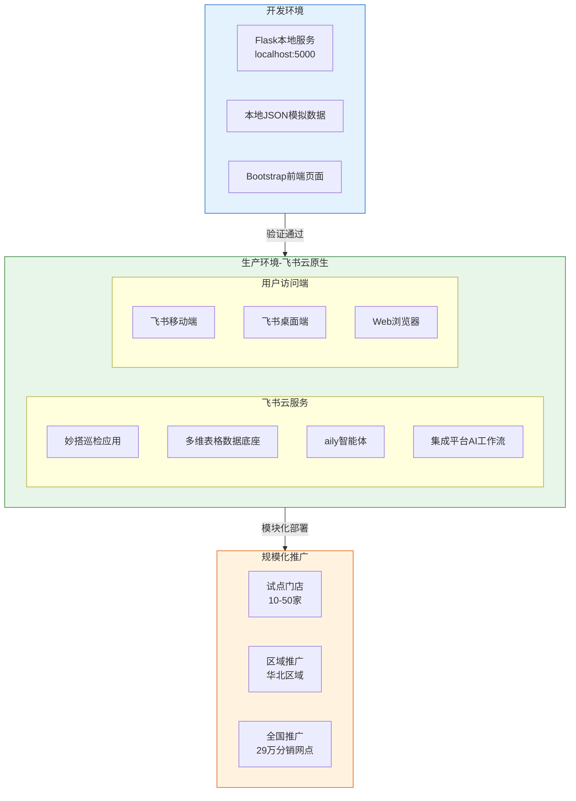

### 6.2 开发环境

| 组件 | 技术选型 | 说明 |
|------|---------|------|
| 后端服务 | Python 3.9+ / Flask 3.0 | 轻量级Web框架，提供API与页面路由 |
| 数据来源 | 本地JSON文件 + 内存模拟 | `data/`目录存储模拟数据，未配置飞书凭证时自动启用 |
| 前端页面 | Bootstrap 5 + Chart.js | 响应式UI与数据可视化看板 |
| 依赖管理 | pip + requirements.txt | flask、requests、python-dotenv |
| 配置管理 | 环境变量 + config.py | 飞书凭证通过环境变量注入，支持Dev/Prod配置切换 |

### 6.3 生产环境

生产环境采用飞书云原生部署，无需独立服务器，全部依托飞书云服务：

| 部署组件 | 飞书服务 | 部署方式 |
|---------|---------|---------|
| 巡检应用 | 飞书妙搭 | 低代码可视化搭建，发布至飞书工作台 |
| 数据存储 | 飞书多维表格 | 创建多维表格应用，配置数据表与AI字段 |
| AI导购 | 飞书aily | 创建智能体，配置知识库与提示词，发布至飞书 |
| AI工作流 | 飞书集成平台 | 可视化编排AI节点，定时触发与事件触发 |
| 用户访问 | 飞书客户端 | 门店店员通过飞书移动端/桌面端访问所有功能 |

### 6.4 扩展性设计

系统采用模块化架构，支持渐进式推广至累计覆盖的29万分销网点：

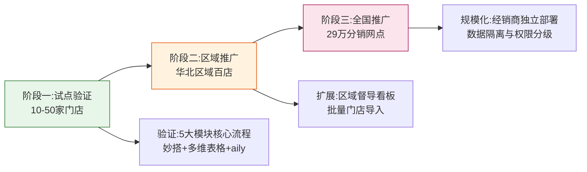

**扩展性保障措施：**

- **模块独立部署**：五大模块可独立启用，门店可按需选择功能模块，降低推广门槛；
- **多维表格扩容**：飞书多维表格支持单表5万条记录，通过分表与归档策略支撑大规模数据；
- **aily并发能力**：飞书aily智能体支持高并发对话，依托飞书云弹性伸缩，无需容量规划；
- **经销商隔离**：通过独立多维表格应用实现经销商数据物理隔离，支撑29万分销网点分权管理。

---

## 七、技术栈

| 层级 | 技术选型 | 说明 |
|------|---------|------|
| 后端框架 | Python 3.9+ / Flask 3.0 | 轻量级Web框架，提供RESTful API与页面路由，适合快速开发与Demo展示 |
| AI智能体 | 飞书aily | 构建产品知识Agent与客户跟进Agent，支持多轮对话、知识检索、内容生成 |
| 数据存储 | 飞书多维表格 | 统一数据底座，支持AI字段、仪表盘、批量操作，含渠道管理表组共8+张数据表 |
| 低代码平台 | 飞书妙搭 | 搭建移动端巡检应用，可视化配置表单与流程，零代码发布至飞书工作台 |
| AI工作流 | 飞书集成平台 | 可视化编排AI节点，实现图像理解、文本分析、定时洞察报告生成 |
| AI图像识别 | 飞书集成平台AI节点-图像理解 | 门店陈列照片合规性检测，识别产品分区、货架利用率、价签覆盖率 |
| 数据分析 | 多维表格AI字段 | 自动分析销售趋势、库存预警、客户分层，无需编写分析代码 |
| 前端UI | Bootstrap 5 | 响应式设计，适配移动端与桌面端，提供巡检、导购、运营看板页面 |
| 数据可视化 | Chart.js | 销售趋势折线图、库存预警柱状图、客流热力图、转化漏斗图 |
| HTTP客户端 | requests 2.31 | 调用飞书开放平台API，封装多维表格与aily客户端 |
| 配置管理 | python-dotenv | 通过.env文件管理环境变量，隔离开发与生产配置 |
| API鉴权 | 飞书OAuth 2.0 / tenant_access_token | 应用级鉴权，令牌自动刷新与缓存 |
| 部署运行 | 飞书云原生 | 生产环境无需独立服务器，妙搭应用+多维表格+aily均部署于飞书云 |

---

## 附录：项目文件结构

```
yuhong-smart-store/
├── docs/                                # 项目文档
│   └── 02_技术方案架构设计文档.md        # 本文档
├── src/                                 # 源代码
│   ├── app.py                           # Flask主应用(API路由+页面路由)
│   ├── config.py                        # 配置文件(飞书凭证+多维表格配置)
│   ├── modules/                         # 五大核心业务模块
│   │   ├── store_inspection.py          # 门店巡检模块
│   │   ├── ai_shopping_guide.py         # AI导购模块
│   │   ├── store_operation.py           # 门店运营模块
│   │   ├── customer_relation.py         # 私域客户维护模块
│   │   └── channel_management.py        # 渠道管理中枢模块（新增）
│   └── api/                             # 飞书API封装
│       ├── feishu_bitable.py            # 多维表格API客户端
│       └── feishu_aily.py               # aily智能体API客户端
├── templates/                           # 前端页面模板
│   ├── index.html                       # 首页/仪表盘
│   ├── inspection.html                  # 门店巡检页面
│   ├── guide.html                       # AI导购页面
│   └── channel.html                     # 渠道管理中枢页面（新增）
├── data/                                # 模拟数据
│   ├── products.json                    # 产品知识库(8款产品)
│   ├── stores.json                      # 门店数据(5家门店)
│   └── inspection_records.json          # 巡检记录
├── requirements.txt                     # Python依赖
└── run.sh                               # 启动脚本
```

---

> 本文档随项目迭代持续更新，最新版本以代码仓库为准。
